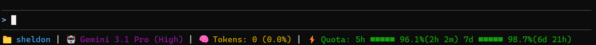

# agy-statusline-rs

[English](README.md) | 中文

[](https://github.com/Sheldonsix/agy-statusline-rs/releases)
[](https://github.com/Sheldonsix/agy-statusline-rs/blob/main/LICENSE)

一个为 Antigravity CLI 编写的轻量级 Rust 状态栏工具。它通过 `stdin` 接收 JSON 数据，并在终端输出包含当前目录、Git 分支、大模型、Token 和额度等信息的紧凑状态栏。



## 安装

**一键安装 (macOS / Linux / WSL):**
```bash
curl -fsSL https://github.com/Sheldonsix/agy-statusline-rs/releases/latest/download/installer.sh | sh
```

**一键安装 (Windows PowerShell):**
```powershell
irm https://github.com/Sheldonsix/agy-statusline-rs/releases/latest/download/installer.ps1 | iex
```
*注：一键安装脚本会自动为你生成默认配置文件。*

**Cargo 安装:**
```bash
cargo install agy-statusline-rs
```
*(要求 Rust 1.85.0 及以上版本)*

## Antigravity CLI 配置

安装完成后，将 Antigravity CLI 的 `statusline command` 设置为 `agy-statusline-rs`（Windows 下为 `agy-statusline-rs.exe`）。如果二进制文件不在环境变量 `PATH` 中，请填入它的绝对路径。

## 配置

配置文件是可选的。默认的模块显示顺序为：`dir -> branch -> model -> tokens -> quota`。

你可以通过命令行参数（如 `--hide-branch`）进行快速隐藏，也可以在系统的标准配置目录下修改 `config.json`：
- **Linux/WSL**: `~/.config/agy-statusline/config.json`
- **macOS**: `~/Library/Application Support/agy-statusline/config.json`
- **Windows**: `%APPDATA%\agy-statusline\config.json`

**配置示例 `config.json`:**
```json
{
  "modules": {
    "dir": { "enabled": true, "order": 10 },
    "branch": { "enabled": true, "order": 20 },
    "model": { "enabled": true, "order": 30 },
    "tokens": { "enabled": true, "order": 40 },
    "quota": { "enabled": true, "order": 50 }
  },
  "display": {
    "color": "auto",
    "icons": "auto",
    "layout": "auto"
  }
}
```
*提示：如果你的终端较老或字体显示不全，可将 `color` 设为 `"never"`，`icons` 设为 `"ascii"`。可以通过 `AGY_STATUSLINE_CONFIG` 环境变量显式指定配置路径。*

## 参与贡献
源码编译：`cargo build --release`。维护者发布新版只需推送 tag（例如 `v0.1.0`），GitHub Actions 会自动编译并发布。

## 开源协议
[MIT License](LICENSE)
